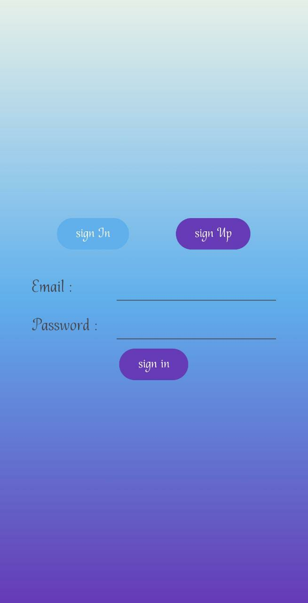
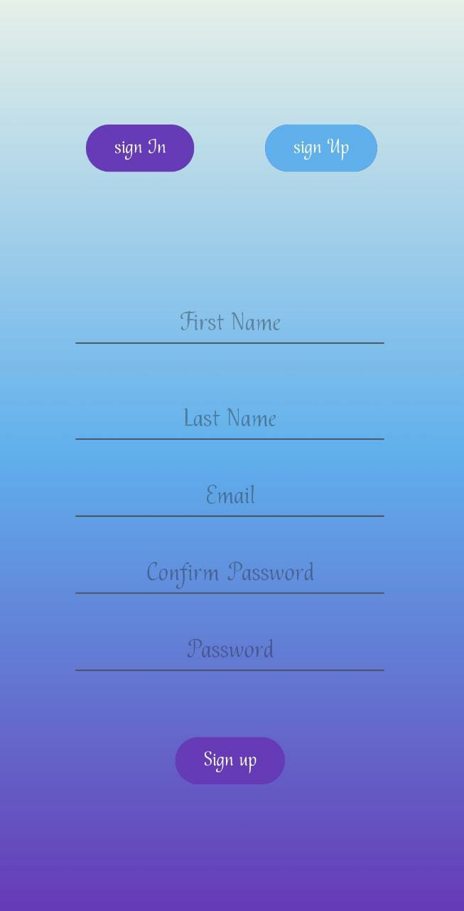

# Signup and Signin App

This Android Studio project implements a signup and signin app that captures personal information from the user, creates an account, and displays the name using a user interface.

## Features

- User signup: Collects personal information such as name, email, and password from the user and creates an account.
- User signin: Validates user credentials and allows them to sign in.
- Display name: Once signed in, the app displays the user's name.

## Prerequisites

- Android Studio installed
- Android SDK

## Screenshots

___

___

